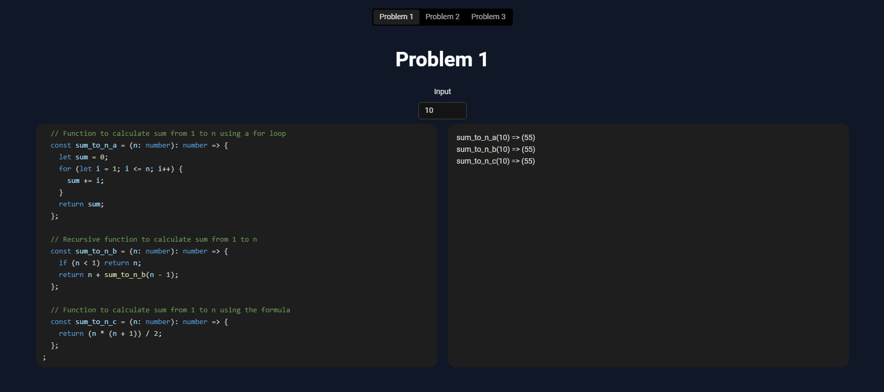

# Solving Test => React + TypeScript + Vite

### You can use this link: https://tranthaidat-test.netlify.app/ to access and review or you can setup and run on local

Setup and installation:

1. Install all the library

```
npm install
```

2. Run local environment

```
npm run dev
```

3. Access to the localhost
4. Navigate through each problem to review


